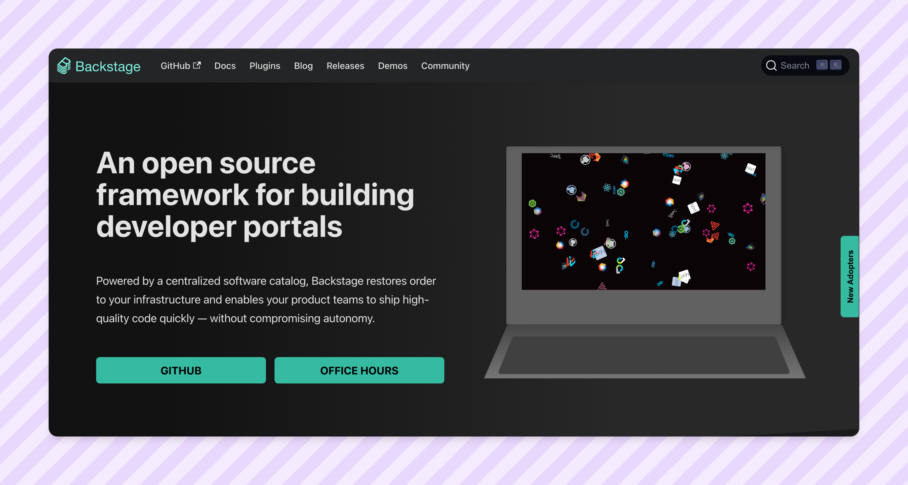

# Backstage Software Templates
A repository with Backstage templates you can use for your internal developer portal. Licensed under the GNU General Public License v3.0.

## Some history
While hearing the news that Spotify was going to attempt to break into [Enterprise IT tooling](https://techcrunch.com/2024/04/30/spotifys-getting-serious-about-its-enterprise-and-dev-tools-business-play/), I found a [useful Hacker News discussion](https://news.ycombinator.com/item?id=40258315). This discussion highlighted that 
> Creating software templates can be a large investment. It would be great if there was a software template marketplace. The backstage contributors took a stab at this by [creating a template repo](https://github.com/backstage/software-templates)

However, that repository that Backstage put together has not been updated in a year with the main parts of the repo not being touched since the launch of Software Templates within Backstage.

## How to Use This Repository
Backstage's repository delineates between `documentation-templates` and `scaffolder-templates` - however, this feels a bit clunky. This repository will be broken up into a few different folders - as outlined below -

- quick wins
- github automation (GHA)
- AWS Lambda preference(s)
- Create React App
- Create Astro App
- Create Next.js App
- Create Maven/Java App
- Create API

## Contributing
Open up a [Pull Request](https://github.com/ctrimm/backstage-software-templates/compare).
